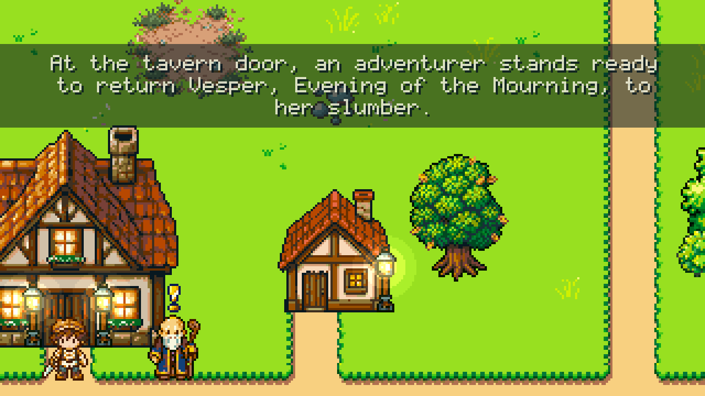
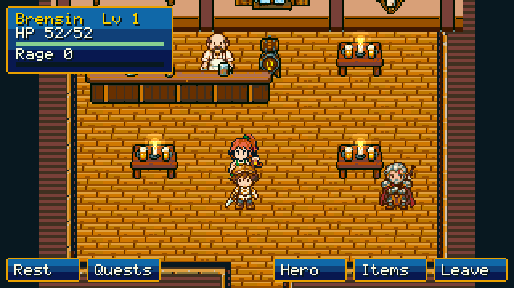
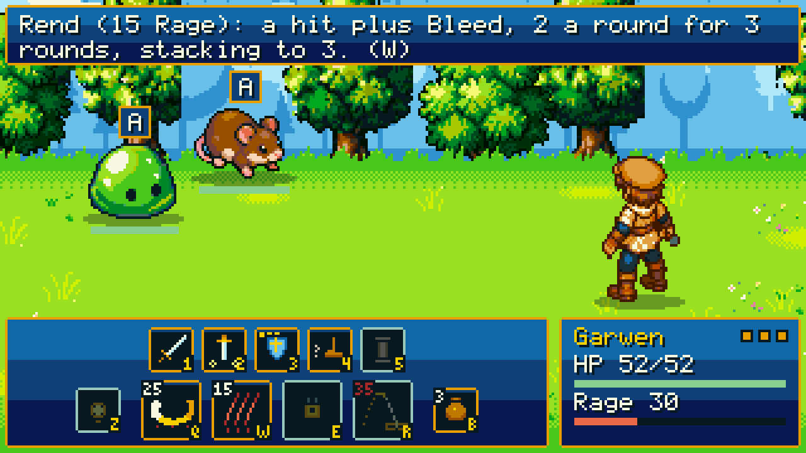
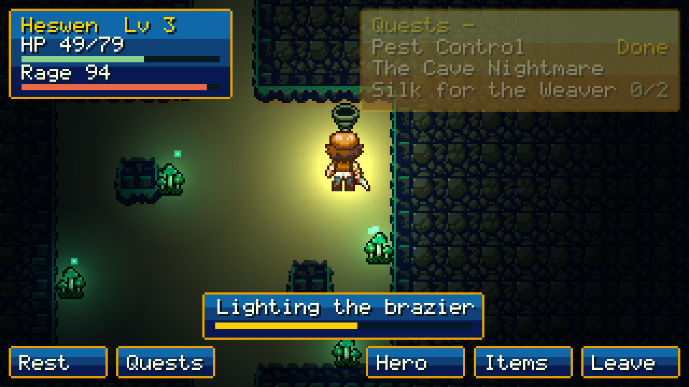

  

<h1 align="center">Ebonhaven</h1>

  <b>A pixel-art roguelite RPG in the browser, where the sun never sets and every hero gets one life.</b> 
  Chapter 1 vertical slice · about 45 minutes · Phaser 4

  <a href="https://dbendt.github.io/ebonhaven-demo/"><b>▶ Play the demo</b></a>

---

## The world

In Ebonhaven, the sun hasn't set in living memory. **Vesper**, the Evening of the Mourning, stopped it
at the horizon so that nothing would ever have to end. Every day is golden hour.

Your heroes are mortal - each gets **one life**. When a hero's story ends, the
**Soulforge** releases them into Essence, a lantern is lit for them, and the next
hero picks up where they fell. The tone is warm melancholy, not grimdark. For presentation, the
bar is Golden Sun and Final Fantasy IX: warm, storybook and readable.

## Chapter 1

A Warrior arrives in **Owlsong**, a village at dusk. The Elder asks for help: something in the
**Nightmare Cave** has the village afraid. Take work at the tavern, fight through the wilds, solve
the cave's lamp puzzle and face the **Broodmother**. Her death gives you the **Emberwick Lantern**,
and its light is the only thing that can part the fog at the edge of the world.

| | |
|:---:|:---:|
|  |  |
| **Owlsong.** The Elder, the notice board and the road to the cave | **The tavern.** The Barkeep sells gear and the trainer teaches abilities |
|  |  |
| **Battle.** Read each enemy's intent, then choose from the hotbar | **The Nightmare Cave.** Light the lamps to open the Broodmother's chamber |

### What's in it

- **Turn-based combat that rewards reading the enemy.** Every enemy shows its intent before you
  act. A heavy blow can be **defended**, and a well-timed defend becomes a **parry** that
  counters. Casts can be interrupted. The Warrior builds **Rage** by hitting and being hit, then
  spends it on Cleave, Rend, Sunder and Reckless Leap.
- **A boss with two phases.** The Broodmother wraps the hero in silk. At half health her egg sacs
  burst and the brood pours out.
- **Six quests:** The Cave Nightmare, Pest Control, Silk for the Weaver, Moonpetals, The Runaway
  (a boy you can only beat by parrying) and Beyond the Fog.
- **Nine monsters** in the wilds and the cave: slimes, field rats, grass snakes, thornbees, cave
  spiders, bats, sporelings, spiderlings, and the Broodmother.
- **Gear and growth:** six equipment slots, rare drops, levels, potions, and abilities learned
  from the trainer.
- **Death that matters:** a tombstone, the Soulforge, Essence, and blessings that carry over to
  the next hero.
- **A world that feels alive:** swaying grass, glinting water, fireflies, flickering lanterns,
  NPCs who breathe and wander, and a vista that opens past the fog at the end of the chapter.

## Controls

Mouse first. Click where you want to go. Click a person or an object and the hero walks up to it
and acts.

| Where | Key | Action |
|---|---|---|
| Field | Click / hold | Walk (hold to keep walking toward the cursor) |
| Field | C | Hero panel: gear and stats |
| Field | B | Bags |
| Field | Z | Use a relic (the Lantern's Reveal) |
| Battle | 1 · 2 · 3 · 4 · 5 | Normal attack · Heavy · Defend · Flee · Cover (boss only) |
| Battle | Q · W · E · R | Cleave · Rend · Sunder · Reckless Leap (the ultimate) |
| Battle | B · Z | Potions · Use |
| Battle | Click an intent | Explains what the enemy is about to do and how to answer it |
| Anywhere | Esc | Back out or close |

Progress saves automatically in your browser.

## How it was made

- **Built with Claude Code**, one lead session plus short-lived worker agents, each working one
  checklist item. Three living documents steered every change: a design doc, an art bible and a
  single checklist.
- **Phaser 4, TypeScript and Vite.** The game rules (combat, runs, the Soulforge) are plain
  TypeScript with no engine code, covered by about 300 unit tests. A fight simulator tuned the
  balance: for example, it checks that Tobin is nearly unbeatable without parrying and easy with
  it.
- **A headless playthrough on every change.** A 123-step Playwright script plays the whole loop,
  from the title through the boss, the Soulforge and a second hero, and takes screenshots that
  were reviewed by eye.
- **Pixel-perfect rendering.** The game renders at 320×180 and scales up only by whole numbers.
  Every colour comes from one master palette.
- **Art:** characters, monsters, portraits and environments were generated with PixelLab, locked
  to approved anchor images and snapped to the palette by a post-processing step. At most two
  rounds per asset; anything that failed both rounds was cut or hand-fixed. Ambient life, spell
  effects, particles and UI icons are drawn procedurally in code.

## Status: what's done and what's left

**Done**
- The full loop: title → a new Warrior → Owlsong → tavern → wilds → cave → Broodmother → the
  Lantern → through the fog → Chapter 1 complete, plus death → Soulforge → a new hero.
- Combat core: intents, defend and parry, interrupts, Rage and four abilities, status effects, a
  hotbar with hotkeys, fleeing.
- All maps, quests and NPC dialog. The art pass is done: no placeholder art is left.
- Battle feel: hit flashes, knockback, hit-stop, screen shake, staggered hits, spell effects,
  idle animations and a victory pose.

**Left for the slice**
- [ ] Final read of the script and dialog
- [ ] The art reference check against Golden Sun and FF9
- [ ] A battle-entry transition
- [ ] Cave lighting: the hero's ember light, with glowing spores as the only other light
- [ ] **Audio:** music for the village, the wilds, the cave, battles and the boss, plus sound
      effects (the demo is silent)
- [ ] Menus: pause, settings (volume, scale), and the full title-screen art
- [ ] Outside playtests, then fixing what they find
- [ ] A 60-second capture video

**Later, beyond the slice**
- More classes (the Amazon first), Chapter 2 and beyond, and the road north to Kirinvar

---

Ebonhaven is a work in progress. This repository hosts the playable build only.

